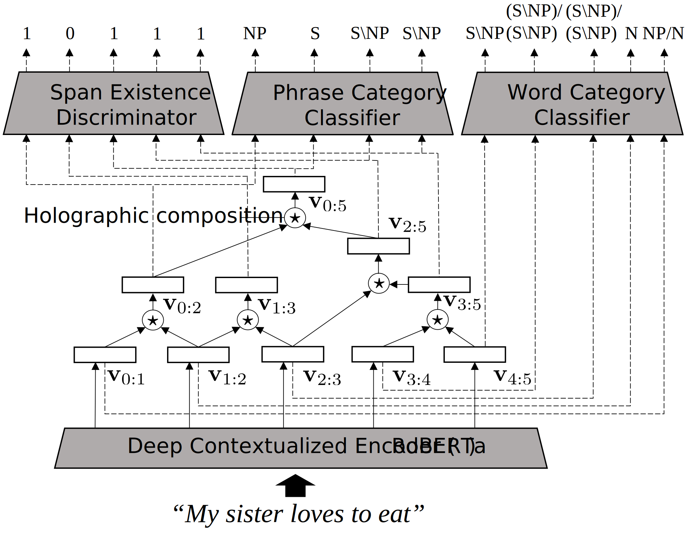

# Holographic CCG (Hol-CCG)
This is the Python implementation of [Holographic CCG Parsing](https://aclanthology.org/2023.acl-long.15/) at ACL2023.



# Prerequisites
- Python >= 3.8.8

- Install libraries
  ```
  pip install -r requirement.txt
  ```
  
- Prepare CCGbank
  - Obtain CCGbank and place it at `dataset/` directory.
  - The name of the directory containing CCGbank data should be `ccgbank_1_1/`

- Preprocess CCGbank
  - Convert CCGbank format to Hol-CCG for training and evaluation.
    ```
    cd src/
    python preprocessing.py
    ```
  - Converted data is stored in `dataset/` directory.
    - `dataset/converted/` -> intermediate `txt` file generated for conversion
    - `dataset/grammar/` -> `.pickle` files for word and phrase categories and other grammar-related information
    - `dataset/tree_list/` -> `.pickle` file converted from CCG's constituency tree
  

# Usage
  ## Training of Hol-CCG
  - Train Hol-CCG by CCGbank.
    ```
    python train_holccg.py
    ```
  - The trained model is stored in `model/` directory.

  ## Supertagging by trained Hol-CCG
  - Supertagging for a list of sentences by a trained Hol-CCG.
    ```
    python supertagging.py --path_to_sentence [path to sentence to be supertagged] --path_to_model [path to trained Hol-CCG]
    ```

  ## Span-based Parsing using trained Hol-CCG
  - Parsing a list of sentences by a Span-based Parsing algorithm incorporating a trained Hol-CCG.
    ```
    python span_parser.py --path_to_sentence [path to sentence to be parsed] --path_to_model [path to trained Hol-CCG]
    ```
  - Use C&C Parser's `generate` program and evaluation scripts to evaluate parsing results.
  - Convert parsing results (`.auto` format) to `.html` for visualization.
    ```
    python auto2html.py --path_to_autos [path to .auto file to be converted]
    ```

  ## Phrase-level infilling experiment
  - Infilling text at the level of phrase using Hol-CCG and RoBERTa.
  - See **Section 5.4** of the paper for details.
    ### Training of RoBERTa for phrase-level infilling
    - Train Hol-CCG by CCGbank for phrase-level infilling
      ```
      python train_infilling_roberta.py
      ```
    - The trained model is stored in `model/` directory.

    ### Run the infilling experiment
    - Infilling on CCGbank data using trained Hol-CCG and RoBERTa.
    - Compute and compare syntactic agreement before and after infilling using Berkeley Parser.
      ```
      python infilling.py --path_to_holccg [path to trained Hol-CCG] --path_to_roberta [path to trained RoBERTa]
      ```
    ### Calculate PMI for Infilling results
    - Calculate and compare PMI for candidates infilled by Hol-CCG and RoBERTa.
      ```
      python calculate_pmi.py
      ```
